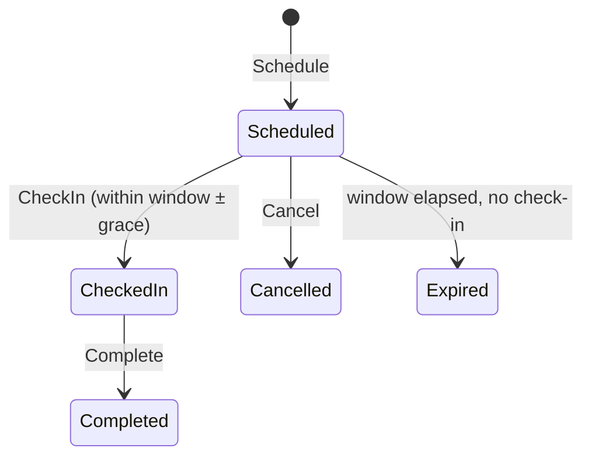
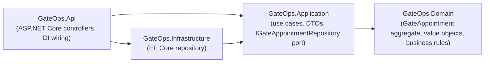

# Port Gate Ops API

A reference implementation of a **generic port/container terminal gate operations API** — appointment scheduling, check-in and check-out — built to demonstrate how I structure backend systems (Clean Architecture, DDD, TDD), not to reproduce any specific employer's or client's system.

> **Why this exists / what it deliberately is not**: I've spent most of my career building gate control, TOS integration and billing systems for real port terminals. None of that code is mine to publish — it belongs to the companies I built it for. This repo is a from-scratch rewrite of the *concept* (how gate appointments, check-ins and yard movements generally work in the industry) using invented data, no real terminal/client names, and no proprietary business rules. It's here to prove the architecture and domain modeling skill, not to leak anything.

## The domain, briefly
A `GateAppointment` is a scheduled visit for a container/vehicle at the terminal gate:
- **Scheduled** → the truck is expected within a time window.
- **CheckedIn** → the truck arrived (within the window, ± a grace period) and was assigned a lane.
- **Completed** → the gate movement (container physically in or out) is done.
- Or it can be **Cancelled** (before check-in) or **Expired** (window elapsed with no check-in).

A container number is validated as a real [ISO 6346](https://en.wikipedia.org/wiki/ISO_6346) identifier — 4 letters + 7 digits, including the check-digit algorithm — because getting that right (and testing it against the standard's own worked example) is a small, self-contained way to show attention to domain detail.



## Architecture
Clean Architecture / Onion, dependencies point inward:



- **Domain** has zero dependencies — the `GateAppointment` aggregate enforces its own invariants (you can't check in twice, can't complete before checking in, can't check in outside the scheduled window, etc.) directly as methods, not as external validation.
- **Application** defines the `IGateAppointmentRepository` port (dependency inversion — the interface lives with its consumer, not with the database code) and orchestrates use cases.
- **Infrastructure** implements that port with EF Core (InMemory provider here, so the repo runs with zero external setup — swapping to SQL Server/PostgreSQL is a one-line change, see `ServiceCollectionExtensions.cs`).
- **Api** is a thin layer: controllers translate HTTP ↔ application calls; a small middleware maps domain exceptions to proper HTTP status codes (`400` for a broken business rule, `404` for "not found") instead of leaking stack traces.

## Testing
TDD-style: 27 tests, all against real behavior, no mocking frameworks.
- `GateOps.Domain.Tests` (20 tests) — the aggregate's rules in isolation: valid/invalid transitions, the ISO 6346 check digit against the standard's own example, grace-period edges.
- `GateOps.Application.Tests` (7 tests) — use-case orchestration against an in-memory fake repository (no EF Core dependency, so these stay fast and don't test Infrastructure by accident).

```bash
dotnet test
```

## Running it
```bash
dotnet run --project src/GateOps.Api
```
Then open `/scalar/v1` for interactive API docs (built on ASP.NET Core's native OpenAPI support + [Scalar](https://github.com/scalar/scalar), not Swashbuckle — this is the current idiomatic approach on .NET 9/10).

Or with Docker:
```bash
docker build -t gateops-api .
docker run -p 8080:8080 gateops-api
```

## What was actually verified (not just written)
Every endpoint and business rule below was exercised against a running instance during development, not just unit-tested in isolation:
- Scheduling, duplicate-active-appointment rejection, invalid container number rejection, out-of-window check-in rejection, complete-before-check-in rejection, the full happy path (schedule → check-in → complete), 404 handling, and the OpenAPI/Scalar docs endpoints.
- The full test suite (27/27) passes.
- The Docker build isn't verified locally (no Docker available in the environment this was built in) — CI builds the image on every push instead.

## License
MIT
